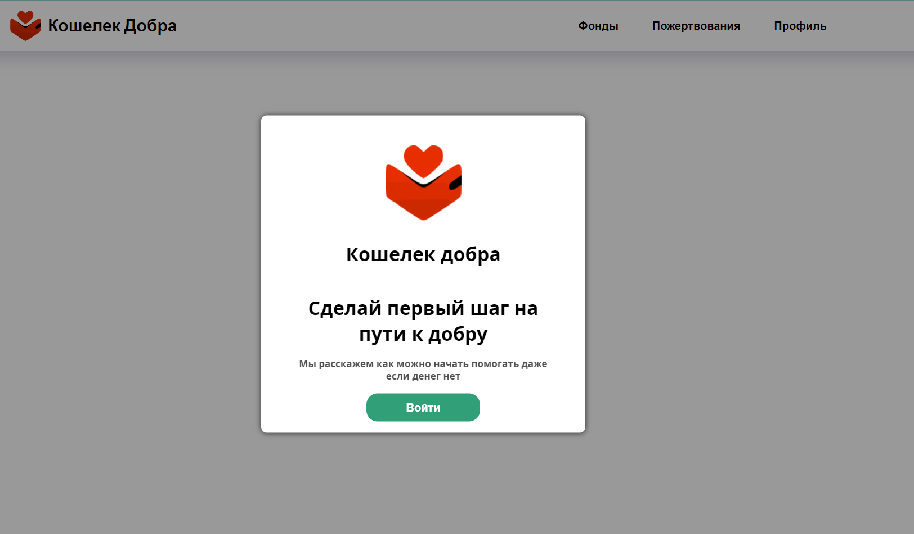
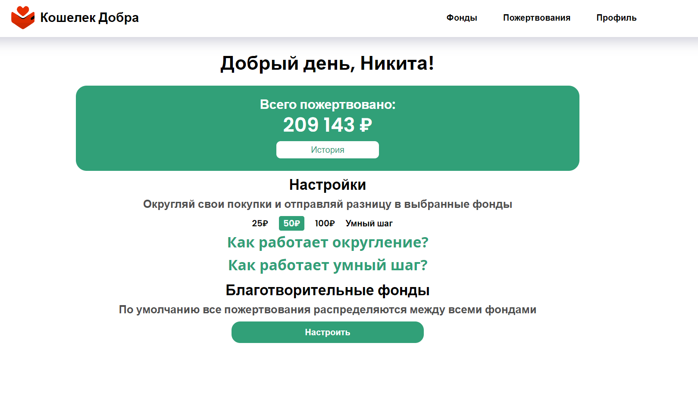

# HELLO WORLD! :earth_africa:
**********
**Charity Wallet FrontEnd**:clipboard:

Main stack of this application: *TypeScript, React.JS, SCSS, HTML, OpenID*:stuck_out_tongue:

This is my *vision* for the implementation of this task.
**********
**Project idea**:question:

The Charity Wallet allows you to receive information about the user’s purchases from any banks, round up the amount of these purchases with a given increment and send the difference to charitable foundations.

The application will be useful for those who want to make a contribution to charity, but do not know where to start and think that this requires a large investment.
**********
**User guide**:paperclip:
1. Download zip-archive with code and open it in *VSCode/WebStorm*.
2. Change directory in console to first/second version
   `cd VTB-API-HackathonFE`
3. In console write next command to install all dependencies and modules for our project.
   `npm install`
4. Then in console write next command to start program in live server.
   `npm run dev`
5. In browser search bar type next text `http://127.0.0.1:5173/` or it will open automatically
6. Enjoy it!
**********
**How does it look like**:eyes:

*Screen of app(unauth)*

*Screen of app(auth)*

**********
I just relax and gained experience here.

Still in progress? Convert to draft!:wink:

>I had all and then most of you. Some and now none of you. Take me back to the night we met. I don't know what I'm supposed to do. Haunted by the ghost of you. Oh, take me back to the night we met :microphone:Lord Huron — The night we met 